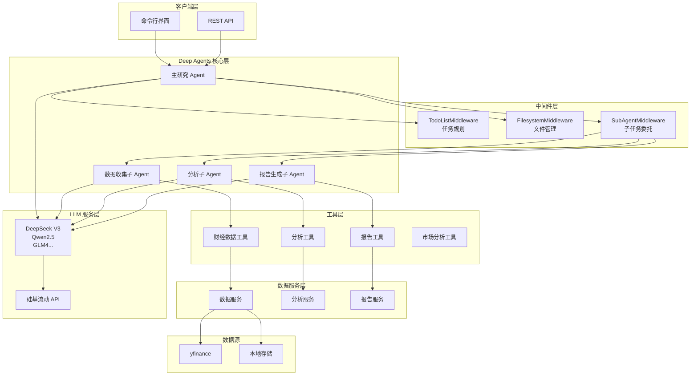
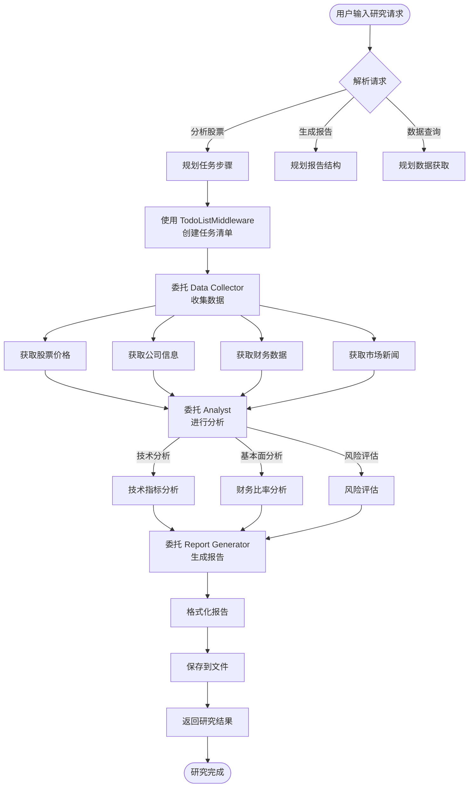
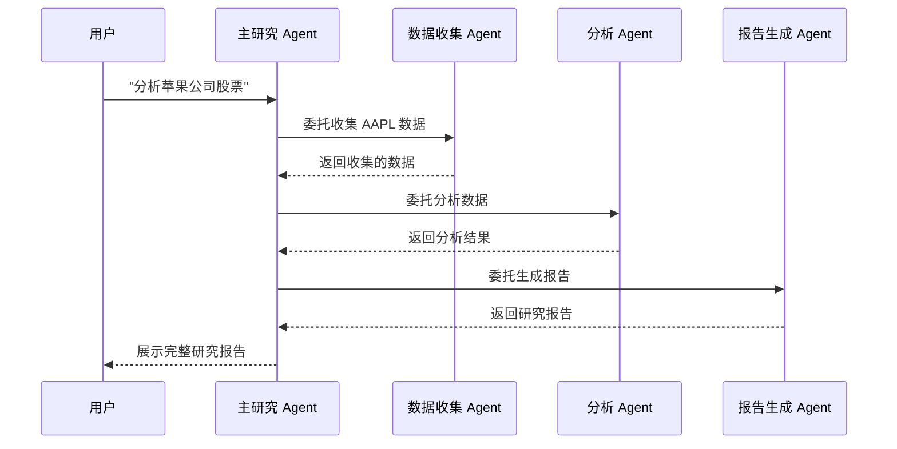

# 投资研究与决策支持 Agent

Investment Research & Decision Support Agent

[](https://www.python.org/)
[](https://github.com/anthropics/deep-agents)
[](LICENSE)

## 项目简介

这是一个基于 **Deep Agents** 框架开发的 AI 投资研究与决策支持系统，旨在辅助或替代金融分析师进行股票分析、市场研究和报告生成工作。

### 核心功能

- **智能数据收集**：自动获取股票价格、财务报表、市场新闻等数据
- **多维度分析**：技术分析、基本面分析、风险评估
- **专业报告生成**：输出结构化的投资研究报告
- **多模型支持**：基于硅基流动（SiliconFlow）API，支持多种开源大模型

---

## 系统架构

### 整体架构图



### Agent 工作流程



### 子 Agent 协作图



---

## 项目结构

```
投资研究与决策支持Agent/
├── README.md                    # 项目说明文档
├── CLAUDE.md                    # Claude Code 指南
├── pyproject.toml               # 项目配置
├── .env.example                 # 环境变量示例
├── .env                         # 环境变量（本地）
│
├── cli.py                       # 命令行入口
├── agent.py                     # Agent 封装
├── main.py                      # 主程序入口
├── run_demo.py                  # Demo 演示脚本
│
├── api/                         # API 模块
│   ├── __init__.py
│   └── main.py                  # FastAPI 应用
│
├── skills/                      # Deep Agents 技能
│   ├── investment-analysis/
│   ├── report-writing/
│   └── risk-management/
│
├── tests/                       # 测试文件
│   ├── __init__.py
│   └── test_finance_tools.py
│
├── www/                         # 前端资源
│
└── financieresearchagent/       # 核心包
    ├── __init__.py
    │
    ├── agents/                  # Agent 定义
    │   ├── __init__.py
    │   ├── main_agent.py        # 主研究 Agent
    │   ├── data_collector.py    # 数据收集子 Agent
    │   ├── analyst.py           # 分析子 Agent
    │   └── report_generator.py  # 报告生成子 Agent
    │
    ├── config/                  # 配置管理
    │   ├── __init__.py
    │   ├── settings.py          # 应用配置
    │   └── llm_config.py        # LLM 配置（硅基流动）
    │
    ├── models/                  # 数据模型
    │   ├── __init__.py
    │   ├── stock.py
    │   ├── report.py
    │   └── analysis.py
    │
    ├── services/                # 服务层
    │   ├── __init__.py
    │   ├── data_service.py      # 数据服务
    │   ├── analysis_service.py  # 分析服务
    │   └── report_service.py    # 报告服务
    │
    ├── tools/                   # 工具库
    │   ├── __init__.py
    │   ├── finance_tools.py     # 财经数据工具
    │   ├── analysis_tools.py    # 分析工具
    │   ├── report_tools.py      # 报告工具
    │   └── market_tools.py      # 市场分析工具
    │
    └── utils/                   # 工具函数
        ├── __init__.py
        └── ssl_fix.py           # SSL 修复
```

---

## 快速开始

### 环境要求

- Python 3.12+
- uv 包管理器

### 安装步骤

1. **克隆项目**

```bash
cd E:\MyProjects\Agent_Projects\投资研究与决策支持Agent
```

2. **安装依赖**

```bash
uv sync
```

3. **配置环境变量**

将 `.env.example` 复制为 `.env`，并填入您的硅基流动 API Key：

```bash
# 复制示例配置
copy .env.example .env

# 编辑 .env 文件，添加您的 API Key
SILICONFLOW_API_KEY=your-api-key-here
```

### 获取硅基流动 API Key

1. 访问 [硅基流动官网](https://siliconflow.cn/)
2. 注册/登录账户
3. 在个人中心获取 API Key

### 运行方式

#### 方式一：命令行界面

```bash
python cli.py
```

或使用 uv：

```bash
uv run python cli.py
```

#### 方式二：API 服务

```bash
uv run python -m uvicorn api.main:app --reload
```

#### 方式三：演示脚本

```bash
uv run python run_demo.py
```

---

## 配置说明

### 主要配置项

在 `.env` 文件中配置：

| 变量名 | 说明 | 默认值 |
|--------|------|--------|
| `SILICONFLOW_API_KEY` | 硅基流动 API Key | - |
| `MODEL_NAME` | 使用的模型名称 | `deepseek-ai/DeepSeek-V3` |
| `MODEL_TEMPERATURE` | 模型温度参数 | `0.7` |
| `MODEL_MAX_TOKENS` | 最大输出 token 数 | `4096` |
| `DATA_DIR` | 数据目录 | `data` |
| `REPORTS_DIR` | 报告输出目录 | `reports` |
| `LOG_LEVEL` | 日志级别 | `INFO` |

### 可用模型

项目支持以下模型（通过硅基流动 API）：

| 模型标识 | 模型名称 | 说明 |
|---------|----------|------|
| `deepseek_v3` | DeepSeek V3 | 默认模型，推荐 |
| `deepseek_v2.5` | DeepSeek V2.5 | 高性能模型 |
| `qwen2.5_7b` | Qwen2.5-7B | 轻量模型 |
| `qwen2.5_14b` | Qwen2.5-14B | 中量模型 |
| `qwen2.5_32b` | Qwen2.5-32B | 重量模型 |
| `glm4_9b` | GLM-4-9B | 开源模型 |
| `glm4_52b` | GLM-4-52B | 高性能模型 |

Embedding 模型：

| 模型标识 | 模型名称 |
|---------|----------|
| `bge_large` | BAAI/bge-large-zh-v1.5 |
| `bge_base` | BAAI/bge-base-zh-v1.5 |
| `bge_small` | BAAI/bge-small-zh-v1.5 |

---

## 使用示例

### 命令行交互

```
============================================================
  投资研究与决策支持Agent
  Investment Research & Decision Support Agent
============================================================

输入您的研究需求 (例如: '分析苹果公司股票/AAPL')
输入 'help' 查看帮助
输入 'quit' 或 'exit' 退出

> 分析 AAPL
正在处理您的请求: 分析 AAPL
...
```

### 代码调用

```python
from agent import ResearchAgent

# 创建 Agent 实例
agent = ResearchAgent()

# 执行研究
result = agent.research("分析苹果公司股票 AAPL")

print(result)
```

### API 调用

```bash
# 启动 API 服务后
curl -X POST "http://localhost:8000/research" \
  -H "Content-Type: application/json" \
  -d '{"stock_symbol": "AAPL", "report_type": "comprehensive"}'
```

---

## 核心模块说明

### Agent 模块 (`agents/`)

| 模块 | 功能 |
|------|------|
| `main_agent.py` | 主研究 Agent，协调整个工作流程 |
| `data_collector.py` | 数据收集子 Agent，获取市场数据 |
| `analyst.py` | 分析子 Agent，进行技术/基本面分析 |
| `report_generator.py` | 报告生成子 Agent，输出研究报告 |

### 工具模块 (`tools/`)

| 模块 | 功能 |
|------|------|
| `finance_tools.py` | 财经数据获取（股价、财务报表等） |
| `analysis_tools.py` | 技术分析工具（指标计算、趋势分析） |
| `report_tools.py` | 报告生成工具 |
| `market_tools.py` | 市场分析工具 |

### 中间件配置

项目使用 Deep Agents 框架的以下中间件：

- **TodoListMiddleware**：任务规划与分解
- **FilesystemMiddleware**：文件操作管理
- **SubAgentMiddleware**：子任务委托

---

## 开发指南

### 运行测试

```bash
# 运行所有测试
uv run pytest

# 运行测试并显示覆盖率
uv run pytest --cov=financieresearchagent

# 运行单个测试文件
uv run pytest tests/test_finance_tools.py
```

### 代码格式化

```bash
uv run black .
```

### 代码检查

```bash
uv run ruff check .
```

### 类型检查

```bash
uv run mypy .
```

---

## 技术栈

| 类别 | 技术 |
|------|------|
| Agent 框架 | Deep Agents, LangChain, LangGraph |
| LLM API | 硅基流动 (SiliconFlow) |
| 数据获取 | yfinance, pandas |
| Web 框架 | FastAPI, uvicorn |
| 数据处理 | pandas, numpy |
| 可视化 | matplotlib, seaborn |
| 配置管理 | pydantic, pydantic-settings |
| 包管理 | uv |

---

## 扩展功能

### 添加新的数据源

在 `financieresearchagent/tools/` 目录下创建新的工具文件：

```python
from langchain.tools import tool

@tool
def get_custom_data(symbol: str) -> str:
    """获取自定义数据"""
    # 实现您的数据获取逻辑
    pass
```

### 添加新的分析类型

在 `financieresearchagent/agents/analyst.py` 中扩展系统提示词和工具集。

### 添加新的报告模板

在 `financieresearchagent/services/report_service.py` 中添加新的报告模板。

---

## 常见问题

### 1. API Key 错误

确保已在 `.env` 文件中正确设置 `SILICONFLOW_API_KEY`。

### 2. 数据获取失败

检查网络连接，或尝试更换数据源。

### 3. 模型响应慢

- 尝试使用更小的模型（如 qwen2.5_7b）
- 检查网络延迟
- 调整 `max_tokens` 参数

### 4. SSL 错误

项目已内置 SSL 修复模块（`utils/ssl_fix.py`），通常无需额外配置。

---

## 项目路线图

- [x] 项目基础架构搭建
- [x] Deep Agents 核心实现
- [x] 硅基流动 API 集成
- [x] 财经数据工具库
- [ ] 分析服务完善
- [ ] 报告模板系统
- [ ] Web 界面开发
- [ ] 数据库持久化
- [ ] 测试覆盖率提升

---

## 许可证

本项目仅供学习和研究使用。

---

## 贡献指南

欢迎提交 Issue 和 Pull Request！

---

## 联系方式

- 问题反馈：[GitHub Issues](https://github.com/your-repo/issues)